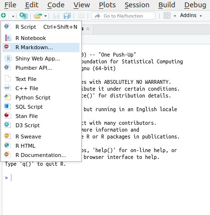
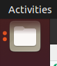
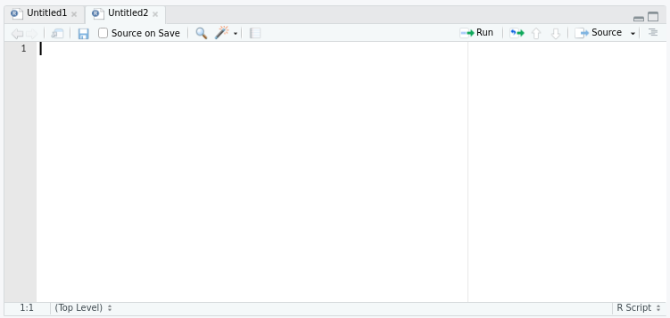
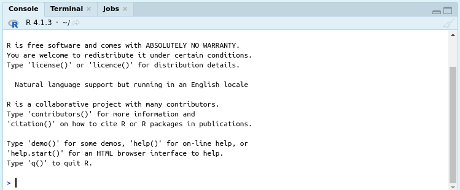
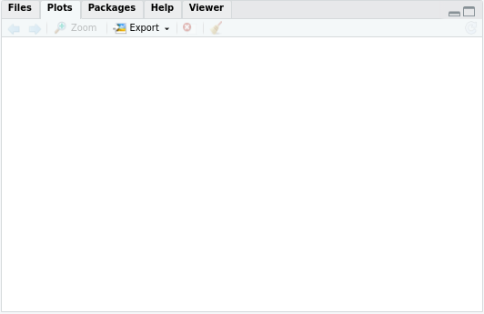
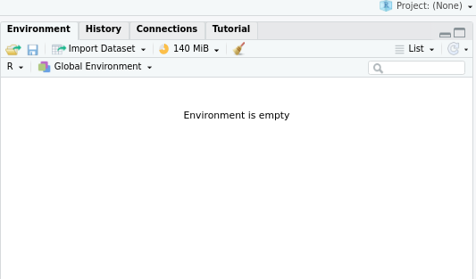

# Navigating RStudio
**Author:** Cole Brookson
**Date:** 25 June 2022

To actually write R code, you will need to use RStudio. When you open the application, you will see something like this: 

You'll need to create a new file to begin writing your code. You can do that with either a `.R` or `.Rmd` file #|# LINK TO FILE ECOSYSTEM #|# like so:

You'll now see there are four distinctive areas of the RStudio window. You can control where each of these panels exists, but this is the default layout:

## Scripts panel

The top left panel is where you'll spend most of your time. This is where your script files (i.e. `.R` or `.Rmd` files) will be displayed, and where you'll write code. 

You can have multiple scripts/files open at once and toggle between them. 

## Console

The console is your direct connection to R. You can type out code onto the line with the carrot `>` and press enter, to execute that line of code. **However, note that here unlike code written in a script, that code will not be saved for you to run again.**

When RStudio first starts up, you'll notice that it prints out the version of R that it is currently running. 

There are two other tabs here "Terminal" and "Jobs" which can be ignored for the beginner. 

## Files/Plots

This bottom right corner is where you can see any current plots, and the files on your computer that are in your current working directory #|# LINK TO WORKING DIRECTORIES #|#. 

You'll notice that there is no plot displayed right now, but should we generate a plot and display it from a script, it would pop up here for us to view. If we navigate to the "Files" tab, we would see the files that are in the current directory that RStudio is working in. 

## Environment 

This top right panel is an important one. R will display all the objects you create through the course of your programming here. That is, any variables or functions you create, with the name and a brief description will be here. To view these objects when they exist, you may click on them directly from the environment panel. 

The beginner may ignore the other tabs in this panel. 