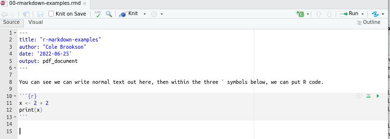

# The File Ecosystem
**Author:** Cole Brookson
**Date:** 25 June 2022

There are a core set of files that R uses the you'll likely run into and want to know the meaning of. 

## `.R` 

The base of the programming language, the `.R` file is the simplest and most commonly used file for writing a program in R. A set of commands in the file, executed in order by the computer, provides the user with a reproducible way of repeating an analysis. 

In `.R` files, all written text is assumed to be written in the syntax and language of R, such as this: 

```
x <- 2 + 2
print("x is ", x)
```

To write comments or notes to yourself or other future users of the file, use the pound symbol or "hashtag" (#) to tell R to ignore that part of the text. 

Example:

If we wanted to leave ourselves a comment telling us what our code will do we could write 
```
x <- 2 + 2
# print the value of x to the console
print(x) 
```

## `.Rmd` 

The `.rmd` file is a special hybrid between an R file `.R` and a markdown file `.md`. This file type gives us flexibility to use both R programming, and write in a normal text editor document like a Microsoft Word doc. Markdown is a lightweight markup language used for creating formatted text. 

In short, we can write both normal text (such as methods or results), *and* include chunks of R code in the same file. This is very handy for writing reports and assignments.

To include an R code chunk in a `.rmd` file, we must put the R code inside a special set of characters that looks like this: 




## `.Rproj`

The last important file you'll use once you're more familiar with R is the `.rproj` file. This file formats an R Project, which is a component of ensuring a reproducible analysis. This file acts to store information about your R Project, as well as point to the directory you have stored your analysis in. This file can also be used as a shortcut for opening the project directly from the filesystem. More about this file type can be found in R Projects. 


