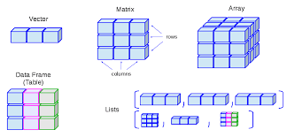

# Data Types
**Author:** Cole Brookson
**Date:** 13 June 2022

## Data Structures

To make use of these individual pieces of data we combine them together into data *structures*. There are 4 main data structures that we work with consistently:

1. Vectors
2. Matrices
3. Dataframes
4. Arrays

This helpful graphic may help you cement these types in your memory



### Vectors

Vectors are subset into atomic vectors (collections of data of the same type) and lists (collections of different data types). Vectors are the workshorses of R and mosts other OOP languages use vectors or a very similar structure to hold data. From this point forward, we’ll use ‘vector’ to refer to atomic vectors and call lists by name. We make vectors the same way we make variables, with an assignment statement.

#### Atomic Vectors

Often we start by making an empty vector that we may decide to fill with values later. To do this, we use the `vector()` function.

```{r}
x <- vector("character", length = 5)
```
v
Here, the function `vector()` takes two required arguments. the first argument asks for the data *type* we would like to use, and the second is the number of elements (the *length*) that we want the vector to be. 

When we already know the content we want included, we can use a simpler `c()` function (`c` is short for *combine*). 

```{r}
x <- c(1, 2, 3, 4)
```

Here, R automatically understands what type of data we're using and since we passed four values, the length is automatically four. We could actually shorten this using R's `:` notation:

```{r}
y <- c(1:4)
```

And we can check this works as expected:

```{r}
x == y
```

**Note:** One thing to understand is that previously when we assigned a variable a single data object (i.e. `x <- 10`), what we were actually doing is making a vector! This is just a special case vector of length 1. 

We can determine what is and what is NOT an atomic vector with the following basic command `is.atomic()`. Recall that lists are *also* vectors, but not the kind we're working with now, so this checks if a vector is an atomic vector or not. 

Vectors, especially string vectors, can change depending on how they're created. For example, here we have two vectors that spell out the same sentence, but are not equivalent:

```{r}
x  <- c("The quick brown fox jumped over the lazy dog")
y <- c("The", "quick", "brown", "fox", "jumped", "over", "the", "lazy", "dog")
x == y
```

We can see by checking the length of each that they lengths are not equivalent. The second vector `y` is actually made up of 9 individual data pieces, while `x` is a singular datum:
```{r}
length(x)
length(y)
```

Vectors are flexible in that we can bind them together easily:

```{r}
x1 <- c(x, "who was sunning himself")
y1 <- c(y, "who", "was", "sunning", "himself")
```

and also simply edit components of them:
```{r}
y[9] <- "cat"
y
```

**Note:** We can only do this here because we createdv each word as it's own data point inside the vector. 

The above is an example of *indexing* which we discuss elsewhere, but for now, it can be interpreted as selecting an element of the vector and changing it. 

#### Lists

Lists are the second type of vector we may want to use. They are more flexible in that they can contain multiple datatypes, whereas atomic vectors must all be of the same type. They are created much the same as vectors:
```{r}
l <- list(1, 2, "R is fun", c(1, 2, 3), TRUE)
l
```
Here we see a number of square brackets denoting the indexing of the list object `l`. This looks confusing but will be discussed in the *Indexing* section. 

We will not work much with lists here as their primary utility does not become apparent until more advanced types of computations are required. 

### Matrices

Matrices are a logical extension of vectors as they can be thought of as a series of vectors bound together to form a 2D structure made up of rows and columns. Matrices have the same limit as a vector and must contain data of the same type (numeric or character). They are also constructed similarly:
```{r}
m <- matrix(nrow = 2, ncol = 2)
m
```
This above is an empty matrix, we haven't told R to put anything in the matrix, but this empty matrix concept is used frequently to preallocate memory before being filled in later. We could make a matrix with some values like this:

```{r}
m <- matrix(100, nrow = 2, ncol = 2)
```

And this will make a matrix with four values of 100. Multiple values are possible as well: 

```{r}
m <- matrix(c(100, 200, 300, 400), nrow = 2, ncol = 2)
```

Here we passed an atomic vector as the first argument to `matrix()`, and then the dimensions that we wanted to get for our matrix. Note that if the dimensions specified are not filled by the vector passed, an error will occur: 

```{r}
m <- matrix(c(100, 200, 300, 400), nrow = 3, ncol = 2)
```
We can also make matrices by combining existing vectors. Let's make two vectors and combine them into a matrix using two different approaches: 

```{r}
vec1 <- c(1, 2)
vec2 <- c(3, 4)
```
First, if I want `vec1` to be the first row and `vec2` to be the second row, I simply need to bind them together as *rows* with the aptly named `rbind()` function:
```{r}
m1 <- rbind(vec1, vec2)
m1
```
If instead I wanted `vec1` to be the first column and `vec2` to be the second column, I would bind them together as *columns* using the `cbind()` function:
```{r}
m2 <- cbind(vec1, vec2)
m2
```
### Dataframes

The darlings of R. These structures are the feature of R that make it so popular for data analysis and statistics. It is the easiest way to store, access, and perform operations on tabular data (the type of data we most often have in biology). Dataframes are actually a type of list, one wherein each element of the list has the same length, making it of dimension 2, which means we easily can look at rows and columns. They’re usually created directly by reading in data (we’ll get to this shortly), or by creation through the `data.frame` command:

```{r}
c1 <- c(1:4)
c2 <- c("item1", "item2", "item3", "item4")
c3 <- c(11:14)

# we can combine these values as columns into a dataframe
d <- data.frame(c1, c2, c3)
d
```
It's easy to add rows or columns using row binding:
```{r}
c4 <- c("add1", "add2", "add3", "add4")
d1 <- cbind(d, c4)
d1
```
Or column binding:
```{r}
r5 <- list(5L, "item5", 15L, "add5") 
d2 <- rbind(d1, r5)
d2
```
Notice above to create row 5, we used `list()` instead of `c()`. Why? Recall that `c()` only works for atomic vectors, so if we used the same arguments but the command `c()`, R would think we wanted an atomic vector, so would actually change our integer values to characters. Let's look at it:
```{r}
r5 <- c(5L, "item5", 15L, "add5")
str(r5)
```
We can see all the values of `r5` are now characters. Also, notice above that we force integer type with the `L` following the number. Why? Well when using `list()`, if we just pass the number `3`, `list()` would interpret that as a numeric type, and when  we bound it to the dataframe, because each column must only have one type, to fix the fact that some values would be integers and some numerics, R would go behind the scenes and change the type of those columns to numerics. Let's see:
```{r}
r5 <- list(5, "item5", 15, "add5") 
str(r5)
```
Note that the first and third elements now have type `num` instead of type `int`!

```{r}
d3 <- rbind(d1, r5)
d3
```
Now we can see in the output that columns `c1` and `c2` have type `<dbl>` which we recall from Data Types are equivalent. This isn't a big deal, but something to be aware of in case we really needed `c1` and `c2` to be integers. 


Dataframes are ultra-flexible, and have a lot of underlying structure. The best way to inspect this structure is with the `str()` command:
```{r}
str(d2)
```
We can also get the column names of a dataframe,

```{r}
names(d2)
```
the number of rows or columns,
```{r}
nrow(d2)
ncol(d2)
```
a summary of the dataframe,
```{r}
summary(d2)
```
For the integer columns, we get a very helpful summary of the values in the column. 

#### Factors

We will briefly discuss factors here as their most common use is as columns in dataframes. 

Factors are variables which can only take on a certain number of values (aka "levels"). They are often referred to as the "categorical" variables of R. They are of special importance in statistical modelling since categorical variables enter into statistical models in a different way than continuous variables may do. 

Similar to other datatypes, they can be created with their own function:
```{r}
fac <- factor(c("one", "two", "three", "four", "one", "two", "three", "four"))
fac
```
The output here shows the values we passed (those within the `c()` function), but the levels aren't maybe what we'd expect. We passed what we know to be numbers, but R can't actually tell that, it just knows they are string values, so has sorted them alphabetically. We can control the *order* of factors with an additional argument to the function `factor()`:

```{r}
fac1 <- factor(c("one", "two", "three", "four", "one", "two", "three", "four"),
               levels = c("one", "two", "three", "four"))
fac1
```
Now the levels are in a more logical order. 

Factors are most commonly used in dataframes, so let's change one of our `chr` variables in a dataframe we've already made to a `factor`. 
```{r}
d
```
Currently `d2` has `c2` column of type `chr`, but let's make it a factor. We could do this by changing the way we define `c2` originally like this:
```{r}
c1 <- c(1:4)
c2 <- factor(c("item1", "item2", "item3", "item4"))
c3 <- c(11:14)

# we can combine these values as columns into a dataframe
d <- data.frame(c1, c2, c3)
d
```
But often we want to perform "in-place" operations to dataframes already created, so let's create the dataframe as before then once created, only re-create that one column:
```{r}
c1 <- c(1:4)
c2 <- c("item1", "item2", "item3", "item4")
c3 <- c(11:14)

# we can combine these values as columns into a dataframe
d <- data.frame(c1, c2, c3)
d
```
So currently it's a `chr`, but we can *index* our column of interest by name, using the `$` operator, and perform the change this way. To change the column to a factor we again can use the `factor()` column: 
```{r}
d$c2 <- factor(d$c2) 
str(d)
```
Now we can see the output has `c2` as a column. More on indexing next!
