---
output:
  pdf_document: default
  html_document: default
---
# Workflow in R
**Author:** Cole Brookson
**Date:** 02 July 2022

This section will take you through a set of best practices for optimizing your daily workflow in R. **NOTE:** This will progress from beginner topics to more advanced usage, so please only operationalize from this section what is relevant to you. 

For this section, we assume you're familiar with R scripts and `.Rmd` files, packages, and some basic programming, including reading in data to R. 

## Workflow for ALL Users

Even if you are a beginner, there are some basics to keep in mind that will make your life SO much easier down the road. 

### Workspace

You will likely have multiple files for the same project, whether lab report or publication. All scripts, data files, figures, and outputs, should be contained in the same place on your computer. 

Imagine you work on an analysis on Tuesday, close R, shut down your computer, and want to begin working on it again on Wednesday. On Tuesday you might have created a bunch of objects in your script, that were saved in your environment. **However, it is best practice to NOT save those objects in your environment until Wednesday.** By structuring your R scripts and data files properly, you can recreate your environment safely each time, without having to worry about whether or not you are keeping any intermediate objects or things by accident. To make sure you do this, change your RStudio settings to not preserve your workspace (environment) in between sessions. 


This will be annoying at first, but it will encourage better habits in the long run. 

### Working Directories

The idea behind a working directory is that there will be one single place where R looks for files to load or to write out to your computer. You can see your current working directory with: 
```{r}
getwd()
```
When you are beginning, I recommend you make a folder in your `Documents` folder or some such place named something easily memorable such as `r-work`. Then, within that location, make sub-folders for each project you may work on. For example, within your `r-work` folder, you may have a subfolder for each class you're taking that requires R (i.e. a path like: `/Documents/r-work/eeb225/`), within which you should have additional folders such as `data`, and `code`. 

This way when you open up a new RStudio session, you can *set your working directory* using: 
```{r}
setwd(".../Documents/r-work/eeb225/")
```
And now if you want to load in any data, you could just write something like 
```{r}
read.csv("./data/lab-1-data.csv")
```
and R would know that it should look for the relevant file in the `/data` file of `/eeb225`. This is very useful and important to thing carefully about. 

**However**, as soon as you are more comfortable in R, you should **NEVER** use the `setwd()` function, and should instead use `RProjects` as described below. While this approach may seem simple and foolproof, it is actually very easy to get confused, and is **not** recommended past the first few usages of R. 

#### RProjects and the `here` Package

Instead of using `setwd()`, there is a simple and even more foolproof solution to linking all your related files together. One can very simply make a new project. In RStudio, click File > New Project then select "New Directory" if you do not have a directory for this set of files yet. If you DO, you can select existing directory. 

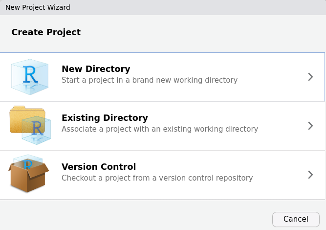

Now, select "New Project"

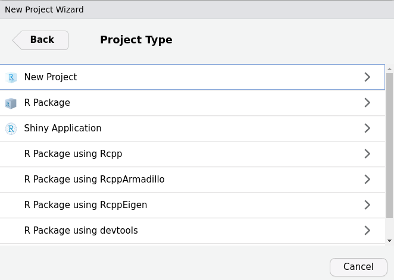

And then name the project: 

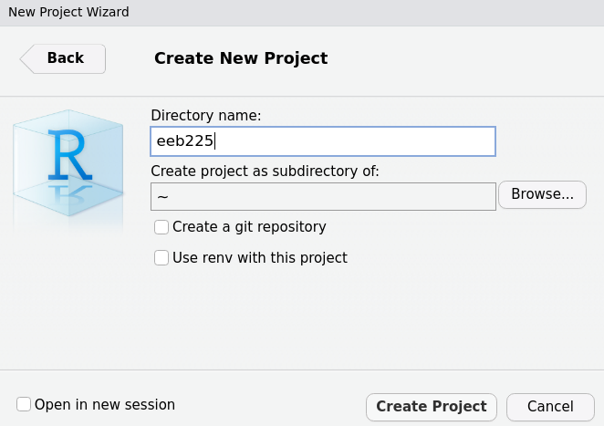
Use a simple and reasonable name. If I want to make a project for a class, it might be easiest to name it after the course code. Then, to select your subdirectory, select "Browse..." and click through to the location you want (we recommend putting a folder called `r-work` inside your `Documents` folder), like this: 

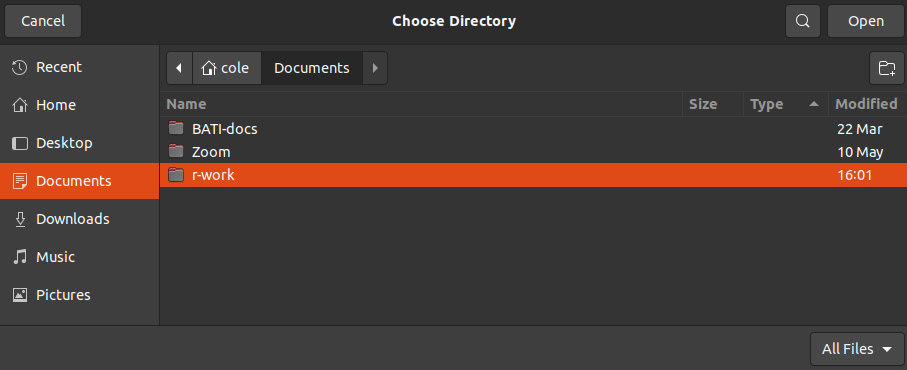

And select the `r-work` folder (for this example). Now we can see the project is ready to create!

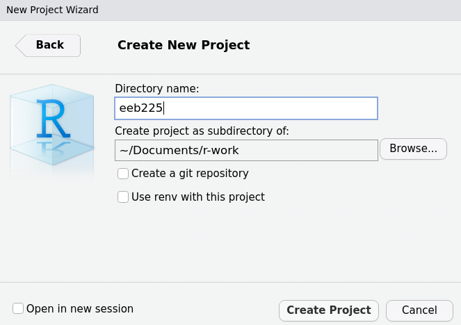
Now simply select "Create Project" to complete the process. Once you do this, RStudio will re-open a new session with that project opened. We can see this in the top right hand corner by the environment: 

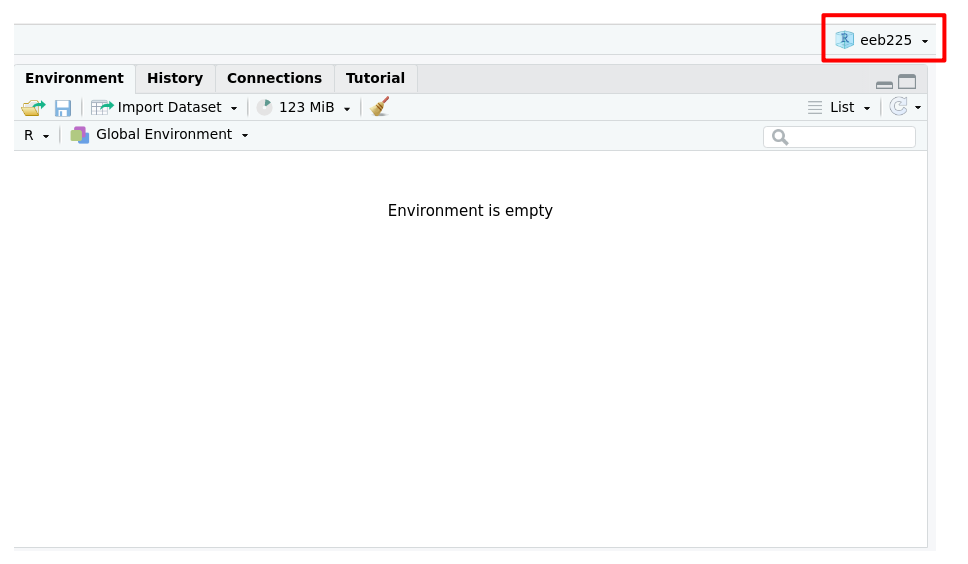

And now our project is all set up and ready to go! If we want to check that it has worked, we can ask R to `getwd()`, and we see the output is exactly what we expected: 

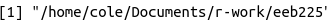


Once you have your RProject set up, it's time to write some code. So within your `/r-work/eeb225`, make a new folder called, say, `code`, and save a new RMarkdown file there that might be for your first lab. That might look like this: 

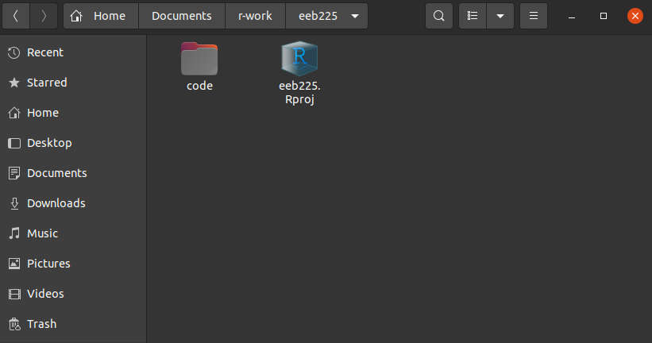
And here we see we now have our RProject (`.Rproj` file) and our folder for code, inside which is 

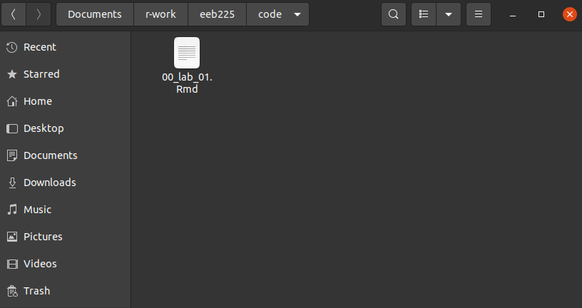
Where we see our file. Note how it is named with numbers at the beginning. See below in the Style Guide for why this is. 

Now let's assume you might get some data for this lab from your TA (i.e. a file called `lab-1-data.csv`) that you'll need to work on the assignment(s). This is where the `here` package comes in. 

If we have a second subfolder in our directory called `data` and within that is our file like this: 

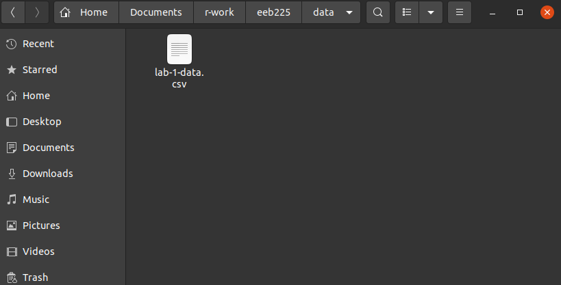

We will want to be able to access that file reliably. In fact, at some point we might even want to send the whole directory (i.e. the whole `eeb225` folder) to someone else, maybe the TA or in the future a collaborator, so they can run it all themselves. 

**This presents a challenge.**

In our new file, 

Whoever you may want to send your project to may not use the same operating system as you (i.e. Mac OS vs. Windows vs. Linux), and they may keep their files in a different place than you. If we used an *absolute* path in our code to read in this data file (something like, "C:/Users/Student1/Documents/r-work/eeb225"), then no one else would be able to use this code, since no one else will have the same absolute path as we do. 

A good solution to this is the `here` package. This package helps us ignore absolute paths, in that the package itself will identify the relevant absolute path for your individual machine, so you only have to specify the *relative path*, that is, the path from the directory to whatever file you refer to. 

If we used an *absolute* path to read in this file, using the tidyverse, our `00-lab-01.Rmd` file may look like this: 

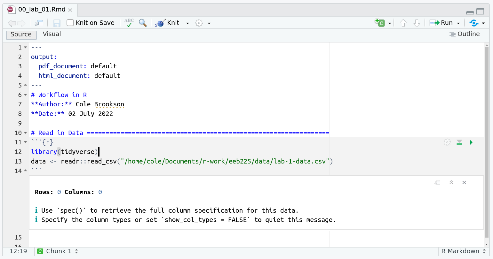
But this wouldn't work for another user! So, we use the `here` package. 

##### `here` Package
First we need to install the package: 
```{r}
install.packages("here")
```
Now we can edit our file to read in the data using the `here()` function. To see how it works, run just `here()` in your console, and you'll notice that it prints the absolute path to the root of your directory! This is the magic of this package! When used along with an RProject, it provides a near-perfect reproducibility across computers and operating systems! 

So our edited file would look something like this: 

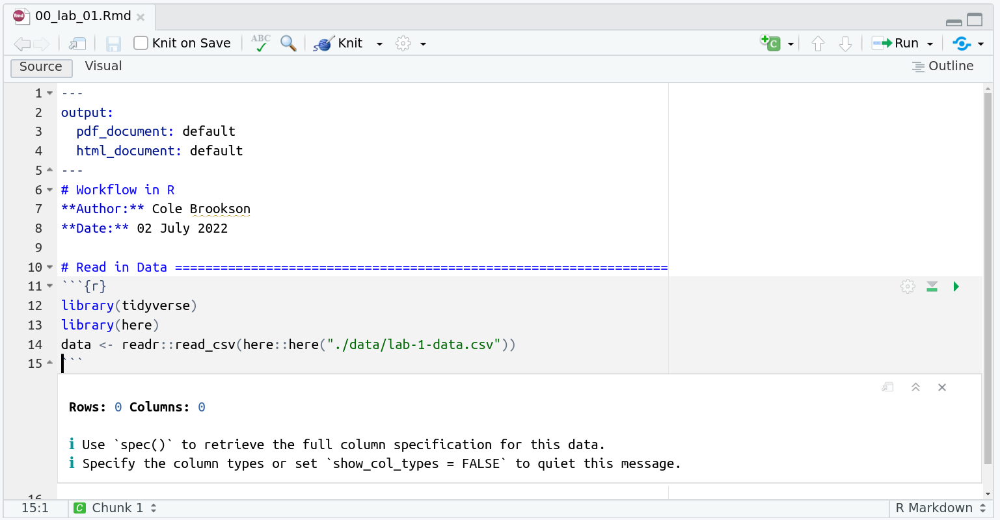
And this works perfectly! Notice what happens if we run just the `here::here()` function: 

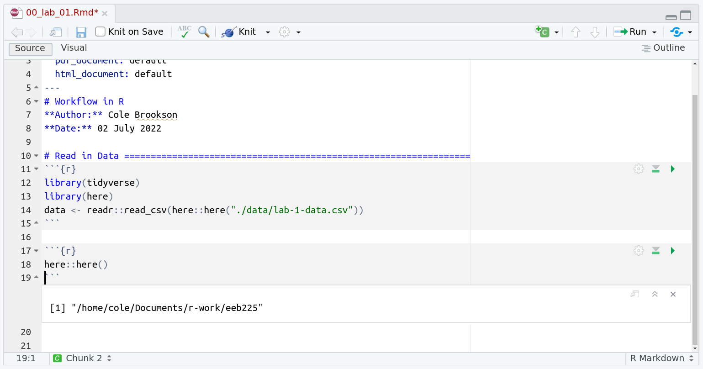
And we see it prints out the absolute path pointing to our current working directory! So when we use the `here()` function, we put in quotation marks, first "./" which signifies everything printed above that the package is taking care of for us, and then the relative path to the file we want, so in our case, "data/lab-1-data.csv"


