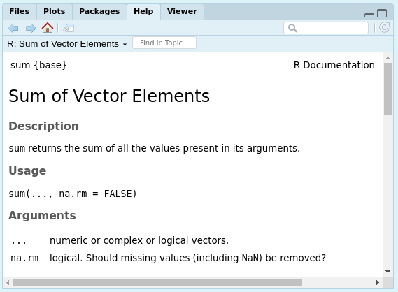

---
output:
  pdf_document: default
  html_document: default
---
# Coding Basics
**Author:** Cole Brookson
**Date:** 13 June 2022

Fundamentally, our goal in using R is to ask our computer to help us answer the biological domain questions we have. In order for R to be useful to us in this sense, we have to know *how* to ask our computer to do these things. It is easiest to think of R as simply a interface between us and our computers. However, we must remember that *computers are not intelligent, they will only do EXACTLY what we tell them to do*. Therefore, we need to be specific about how we ask our computer to do things in service of answering our biological questions. This section covers some important concepts that will govern how we ask R to do things for us. 

## R as a Calculator

At the most basic level, we can use R as a (very complicated) calculator. We can perform all the most basic operations that we might be interested in. 

The classic operations (addition, subtraction, multiplication, division) work much as you might expect 

```{r}
2 + 2
3 - 2
3 * 2 # multiplication is denoted by an asterisk
6 / 2
2 ^ 3 # exponentiation is denoted by this carrot
```

You can also ask R to help with more complicated operations such as:

**Modulo operations** (getting the remainder of a division)
```{r}
5 %% 2
```

**Integer Division** (only returns the integer value and not the decimal places)

```{r}
5 %/% 2
```

## Boolean Operations

We can ask R to make comparisons between values and give us a boolean (true or false) response for a wide variety of operations. 

We can ask R if two values are equal `==`, inequal `!=`, greater than `>`, less than `<`, greater than *or equal to* `>=`, or less than *or equal to* `<=`. Some examples:

```

```
```{r}
2 == 2
2 != 3
2 > 4
```

We can also ask R if two things are true at the same time using the ampersand `&` operator, or if *at least* one statement is true using the vertical bar `|` operator:
```{r}
2 == 2 & 3 == 3
2 == 2 & 3 == 4
2 == 2 | 3 == 4
2 == 3 | 3 == 4
```

We can also chain these operations together, but the order in which we write this out matters. Computers follow order of operations rules just like in math, so we need to think back to BEDMAS (Brackets, Exponents, Division, Multiplication, Addition, Subtraction) from grade school math class! 

**Exercise** Mentally work through what answer (`TRUE` or `FALSE`) R will output when you run this code, then check the answer to see if you were right!
```{r}
(2 == 2) & (2 == 3 | 3 == 3)
```

## Assignment

You'll notice that up to now, we have simply been using numbers, but we can also use variables in R to store the values of numbers. If we wanted a variable `x` with value `2`, we could assign this value in R using the *assignment* operator, `<-`. Once a variable is assigned, that variable will be stored in the environment, and can be called at any later point in the session. 

```{r}
x <- 2
x
```

**Two important notes with assignment:**

1) In R, assignment can be done either through `<-` or `=`. Both will work identically, but the `<-` assignment operator is the more commonly used one and is technically best practice
2) If you make an assignment of a value to a variable, that assignment is not permanent. You can overwrite that assignment simply by using the same variable name (i.e. `x`)
```{r}
x <- 1
x <- 2
x
```

## Built-in Functions

Most of your initial use of R will be employing built-in functions that R has available for you to employee. For example, we might want to know the sum of a set of numbers. 
```{r}
sum(1, 6, 8)
```

Functions are discussed in more depth later, but generally, the way they work in R is by calling the word for the function (i.e. `sum`) followed by a set of parentheses, that take the functions *arguments*. Arguments are simply a few items that the function needs to provide the right answer to the question. 

One can always find what arguments are needed in the function by running `?` and then the function in question. For example, 

```{r}
?sum
```

This will not return anything to the console, but in the bottom right panel of RStudio, the help window will open, with the *documentation* on the function. For the `?sum` example, the output is: 



**TIP:** When in doubt about how to use a function, or really anything in R, check the documentation!

## Naming 

A lot of R is assigning values to variables, and each of those variables will need a name. Many programming languages have "style guides" that are a generally agreed-upon set of standards by the community of users that dictate how best to do common tasks in that language. 

There are a handful of suggested style guides in R, but the most common and the one followed in this resource is [Hadley Wickham's style guide](http://adv-r.had.co.nz/Style.html), which is based on that of Google's R style guide. 

With respect to naming: 

*Variable and function names should be lowercase. Use an underscore (_) to separate words within a name. Generally, variable names should be nouns and function names should be verbs. Strive for names that are concise and meaningful (this is not easy!).* 

