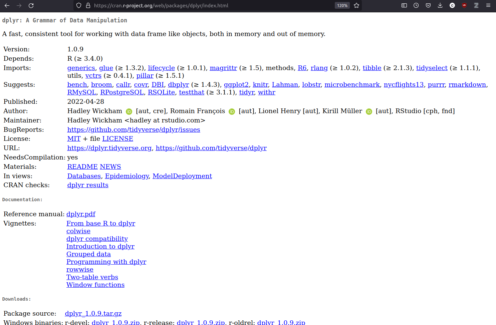
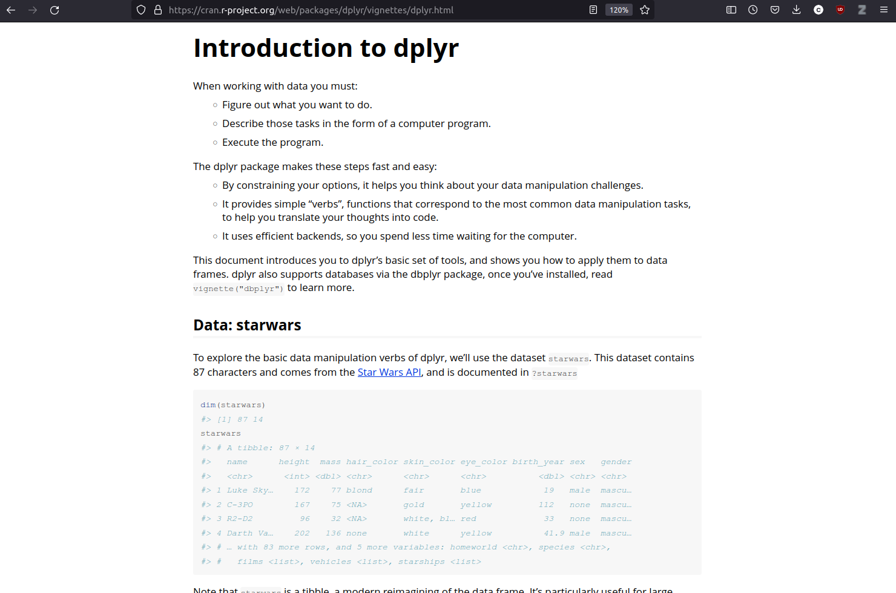

---
output:
  pdf_document: default
  html_document: default
---
# Packages in R
**Author:** Cole Brookson
**Date:** 22 June 2022

## What Are Packages?

R packages are collections of related functions, code, and data, which can be downloaded and used by any R user, as a way of avoiding having to write all the code to do a task manually themselves. All official packages are submitted and verified through CRAN (Comprehensive R Archive Network). While a number of functions and capabilities ship natively with "base" R, packages typically are sets of functions that perform related tasks (e.g. data management). For example, if in an R script or `.Rmd` file, we begin to type the function `subset()`, we get the following: 


We see here that R is suggesting some options to us of functions that start with `sub`. The word in the curly braces, `{base}` indicates that that function is native to "base" R, or the base set of functions and methods that we have access to without loading in other packages. When you download R, a set of packages are imported automatically, including `base`, `stats`, and some others. Packages not downloaded automatically with R need to be explicitly loaded separately. 

There are many many packages, the vast majority of which we will not even talk about. In fact, as of November 2020, more than 16,000 packages were available on CRAN (and that's not including the non-CRAN packages that are available too!).

Note that many packages are termed *dependencies*, that is, they are not the packages we are going to use directly, but they are required on our computers, for the package we **do** want to use to work properly. 

## Loading Packages

We can check what packages we have installed on our computer by running the `library()` command. 
```{r}
library()
```
On this computer, that returns a large number of packges, but on your computer it may return less. 

The EEB R Manual will make use frequently of packages that are part of the *Tidyverse*. The Tidyverse is "...an opinionated collection of R packages designed for data science. All packages share an underlying design philosophy, grammar, and data structures" that is funded and developed by the RStudio foundation. See more about our opinions on the tidyverse elsewhere. One of the first packages we'll use is the `dplyr` package, a very common and useful data cleaning package. 

As a demonstration, let's install the `dplyr` package: 

```{r}
install.packages("dplyr")
```
You will get a long output as the package installs, and you can tell if it has successfully installed, by attempting to load the package via the `library()` function:
```{r}
library("dplyr")
```
There is some important information here in this library load. First of all, we see that two packages, `package:stats` and `package:base` now have "masked objects". The objects that are masked for each of these packages are listed. For `stats`, `filter()` and `lag()` are masked, and for `base`, the functions `intersect()`, `setdiff()`, `setequal()`, and `union()` are masked. 

Don't worry, you don't have to do anything about this, but just know that **this means there are functions in the `dplyr` package with the same names (i.e. `filter()` and `lag()`, and `intersect()`, `setdiff()`, `setequal()`, and `union()`) as functions that were already loaded in R. So, if you just call the function `filter()` it will default to using the function named `filter()` from the `dplyr` package, and NOT from the `stats` package. 

It is good practice to be explicit about what package you are using for what task with the `package::function()` notation. That is, if I wanted to use the `filter()` function from `dplyr`, I would write: `dplyr::filter()`, but if I wanted to use the function from the `stats` package I would write `stats::filter()`. This way R will not get confused and perhaps default to the wrong package!

## Using Packages in Scripts

As we will discuss in the "Workflow" section, any packages that we need for an analysis should always be loaded at the top of the script we're working in. For example, if I wanted to use two packages in a script, `here` and `dplyr`, I would load them both at the very top of my new R script like this: 

```{r}
library(here)
library(dplyr)
```
Note that I do **not** use the `install.packages()` function here, as once a package is downloaded once, we don't need to download it again, and it will save us time to not do so. It is usually recommended to run any installations in the console, or else to comment them out of our code like this: 
```{r}
# install.packages("here", "dplyr")
library(here)
library(dplyr)
```

## Learning More About a Package

As you begin to learn R, you'll often hear or read the phrase "there's a package for that!" 

Almost any task you can imagine wanting to do in R probably has a package to achieve that task that someone has written before. While some packages (like the `Tidyverse` packages) are written by software developers who are paid to do so, most packages are "open source" which means that they are written by enthusiasts (who may also be software developers, but are not explicitly paid to write R packages) in their spare time, and are made openly available to anyone who wants to use them. 

When you begin using a package, you may have questions about how it works. All packages on CRAN come with a "vignette", a worked example using some functions from the package to demonstrate it's usefulness. You can access these vignettes on [CRAN TaskViews](https://cran.r-project.org/web/views/). The TaskViews are also helpful as they are organized by the type of Task you may want to do, and can help direct you to a package that may work for your purposes. 

As an example, we can search for the `dplyr` package on the [CRAN website](https://cran.r-project.org/web/packages/available_packages_by_name.html), and navigate to it's CRAN homepage: 


And we see there is a whole section for vignettes at the bottom. Since `dplyr` is a `Tidyverse` package, the documentation is extensive, significantly more than most other packages. 

If we click on the *Introduction to dplyr* page, we'll find out lots about how to use `dplyr` in a convenient format: 



We'll talk more about some specific packages that will be helpful to you. 

## Package Conflicts

When we load a package (i.e. library(package)), we are doing what's called loading a "namespace". That is, with that package, we now have access to all sorts of functions and objects that we are literally downloading from the internet for our own use. When we start to use more and more packages, perhaps unsurprisingly, we'll come across functions from different packages that are called the same thing. For example, in <code>base R</code> there are functions called "intersect", "setdiff", "setequal", and "union", among others. In the package <code>dplyr</code> which is a very popular package in the Tidyverse for working with data, there are <em>also</em> functions called "intersect", "setdiff", "setequal", and "union". This presents a problem! Since we will always load the package <code>dplyr</code> after <code>base</code>, R will use an order of recent precedence, to assume that if we were to call <code>setdiff()</code> on an object, we would mean the <code>dplyr</code> version. However, sometimes we might want the base version, so what can we do? 

Luckily, we can always specify which package we want, with the double-colon operator <code>::</code>. This works by putting the package before the two colons, and the function name after them. E.g: <code>dplyr::setdiff()</code>. Now, our computer (and more importantly, us or other humans who will likely read our code again later!) won't have to guess which package we're using. 

There are some situations where this is less or more important. For example, when plotting, we often use the <code>ggplot()</code> function from the <code>ggplot2</code> package. There isn't another common package that has the function <code>ggplot()</code> in it's namespace, so we can pretty safely just write <code>ggplot()</code> when writing code. However, for functions that are more common in terms of their names, it's best to do so, and we will do this throughout this manual to avoid any and all confusion. 

For an example as to how this conflict can arise, check out the output of this chunk of code: 

<code>
library(stats)
library(dplyr)
</code>

<code>dplyr</code> has conflicts with both <code>stats</code> and <code>base</code> packages, so it's best to deal with that up front. 

