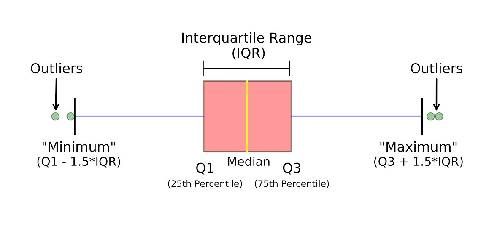

---
output:
  pdf_document: default
  html_document: default
---
# Facetting Plots
**Author:** Cole Brookson
**Date:** 20 July 2022

Displaying all the relevant information on a single plot panel is ideal as it minimizes the amount of space consumed, but it sometimes impossible to use only one single plot panel and maintain a readable plot that isn't crowded or trying to do so much. In this case, a handy approach is to <em>facet</em> the plot which essentially breaks up the plot into multiple panes so that they can be viewed together. 

Often, this is the case when one or both axis are the same, and a separate variable or group of that variable is being shown on each plotting pane. For example here, let's refer to data on stream chemisty: 

<!--begin.rcode, warning=FALSE
library(tidyverse)
library(lterdatasampler)

df <- lterdatasampler::luq_streamchem
df
end.rcode-->

There are two variables we might want to compare - Sodium (Na) and Potassium (K). One option could be plotting them through time with two y-axes, but these plots are often confusing. An easier to interpret way would be to have two separate plot panels. This will require some data prep first. 

## Data Preparation

One (not the only) way to go about this, is to get both of our variables of interest into one column, with a separate grouping column that denotes what the values refer to. The easiest way to do this is by <em>re-shaping</em> the data (LINK TO RESHAPING HERE) Let's do that here: 

<!--begin.rcode, warning=FALSE
df_long <- df %>% 
  # remove columns we don't need
  dplyr::select(sample_date, na, k) %>% 
  tidyr::pivot_longer(
    # specify which columns to join together
    cols = c(na, k),
    # specify what the new name of the grouping variable will be
    names_to = "element"
  )
df_long
end.rcode-->

Perfect! We will also want to pull out the month and year values as columns since it will be month we'll use to group by in our plots.

<!--begin.rcode, warning=FALSE
library(lubridate)

df_long <- df_long %>% 
  dplyr::mutate(
    year = lubridate::year(sample_date),
    month = lubridate::month(sample_date)
  )
df_long
end.rcode-->

Now we can do about plotting this iteratively (LINK TO ITERATIVE PLOTTING). In this example, we'll use a box plot (LINK TO CHANGE OVER TIME) since it's one way to show a change through time. As a quick refresher, here's how we can interpret a boxplot:

## Plotting With No Facet

Let's begin by plotting only the bare necessities: 

<!--begin.rcode, warning=FALSE
ggplot() + 
  geom_boxplot(data = df_long, mapping = aes(x = year, y = value))
end.rcode-->

Well that didn't quite work out. We will need to make <code>year</code> a factor here:

<!--begin.rcode, warning=FALSE
df_long = df_long %>% 
  dplyr::mutate(
    year = as.factor(year)
  )
end.rcode-->

Now we'll try again: 

<!--begin.rcode, warning=FALSE
ggplot() + 
  geom_boxplot(data = df_long, mapping = aes(x = year, y = value))
end.rcode-->

That looks better. <strong>Now here's why we might want to facet:</strong> right now our plot is displaying <strong>both</strong> sodium and potassium in the same <code>value</code> which doesn't makes sense since they're completely different scales of measurement. We could try to address this by separating them out by some aesthetic (e.g. colour), so let's try that: 

<!--begin.rcode, warning=FALSE
ggplot() + 
  geom_boxplot(data = df_long, mapping = aes(x = year, y = value,
                                             colour = element))
end.rcode-->

Ok so now we have grouped box plots. I suppose in theory we could leave it like this, but I am not personally a fan. Let's add in the necessary components and then think about faceting: 

<!--begin.rcode, warning=FALSE
ggplot() + 
  geom_boxplot(data = df_long, mapping = aes(x = year, y = value,
                                             colour = element)) + 
  labs(x = "Year", y = "Amount of Element (mg/L)") +
  ggthemes::theme_base()
end.rcode-->

Nope, still heinous! Time to facet! We'll make this on two panels by faceting using <code>facet_wrap()</code> and operating on the <code>element</code> variable. I also want the plot to display as two plots stacked <em>on top</em> of one another, so I can refer to the number of columns as 1 to force the <code>facet_wrap()</code> to do this. 

<!--begin.rcode, warning=FALSE
ggplot() + 
  geom_boxplot(data = df_long, mapping = aes(x = year, y = value,
                                             colour = element)) + 
  labs(x = "Year", y = "Amount of Element (mg/L)") +
  ggthemes::theme_base() +
  facet_wrap(~element,
             # I want this to be one column with two rows
             ncol = 1)
end.rcode-->

Ok, we're getting there! However, the scales for both are not helping. Let's fix it so the sodium can vary within it's max & min, and the potassium can vary within it's (different) max & min. We can do this with the <code>scales</code> argument in the facet_wrap.

<!--begin.rcode, warning=FALSE
ggplot() + 
  geom_boxplot(data = df_long, mapping = aes(x = year, y = value,
                                             colour = element)) + 
  labs(x = "Year", y = "Amount of Element (mg/L)") +
  ggthemes::theme_base() +
  facet_wrap(~element,
             # I want this to be one column with two rows
             ncol = 1,
             scales = "free")
end.rcode-->

Okay, this is looking better! Now it feels like we can actually see the spread of the data. We can still make some aesthetic changes however. Let's change to a <code>fill</code> not a <code>colour</code> on our box plot: 

<!--begin.rcode, warning=FALSE
ggplot() + 
  geom_boxplot(data = df_long, mapping = aes(x = year, y = value,
                                             fill = element)) + 
  labs(x = "Year", y = "Amount of Element (mg/L)") +
  ggthemes::theme_base() +
  facet_wrap(~element,
             # I want this to be one column with two rows
             ncol = 1,
             scales = "free")
end.rcode-->

Good, and now we'll change the actual colours we're using with <code>scale_fill_manual()</code>:

<!--begin.rcode, warning=FALSE
ggplot() + 
  geom_boxplot(data = df_long, mapping = aes(x = year, y = value,
                                             fill = element)) + 
  labs(x = "Year", y = "Amount of Element (mg/L)") +
  ggthemes::theme_base() +
  facet_wrap(~element,
             # I want this to be one column with two rows
             ncol = 1,
             scales = "free") +
  scale_fill_manual(values = c("#90ee90", "#F8E473"))
end.rcode-->

I would also like to change the legend to have the full names of the elements. Recall we can <em>also</em> use the <code>scale_fill_manual()</code> to perform this:

<!--begin.rcode, warning=FALSE
ggplot() + 
  geom_boxplot(data = df_long, mapping = aes(x = year, y = value,
                                             fill = element)) + 
  labs(x = "Year", y = "Amount of Element (mg/L)") +
  ggthemes::theme_base() +
  facet_wrap(~element,
             # I want this to be one column with two rows
             ncol = 1,
             scales = "free") +
    scale_fill_manual("Element", 
                      values = c("#90ee90", "#F8E473"),
                      labels = c("Potassium (K)",
                                 "Sodium (Na)"))
end.rcode-->

Looks good! But one last thing. Somewhere along the way, there have developed some ugly labels on the top of each of the plots. We could expand them so they have the same thing as the legend. This is done via the <code>labeller</code> argument inside the call to <code>facet_grid()</code>. We pass a vector of matching values to the <code>as_labeller()</code> function and that goes as the argument to <code>labeller</code>. Yes, it's all annoyingly complicated ...

Okay, well there we have it!! I would personally argue that you could likely leave off either the legend <em>or</em> the title as you really only need one of the two, but for the sake of practice, we can leave it as is. 

