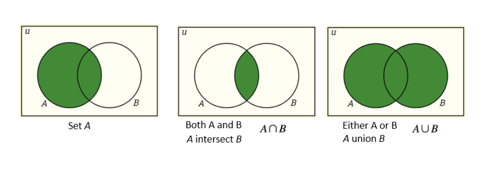
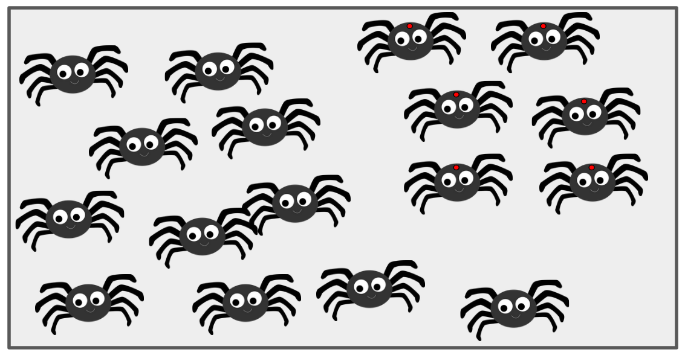
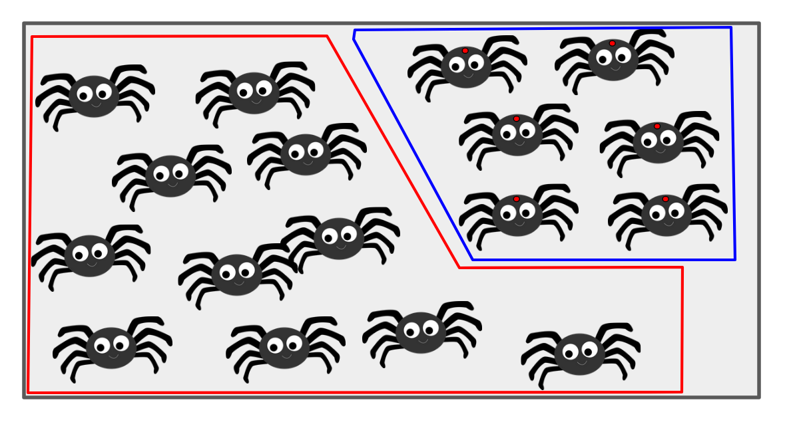
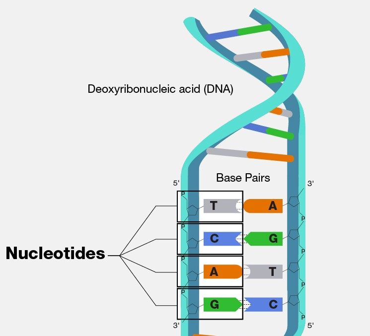

---
output:
  pdf_document: default
  html_document: default
---
# Probability 
**Author:** Cole Brookson
**Date:** 29 August 2022

## An Introduction (And Disclaimer...)

There are many excellent texts on probability and probability theory. There are numerous courses in several departments at the University of Toronto, and indeed pretty much any university, that can offer you the student a truly grounded view of what probability is and how to think about it. Indeed, probability itself can be interpreted in multiple ways, and multiple theories about foundational probability and how to interpret it exist. Most of the concepts in this section are unabashedly stolen from the <strong>excellent</strong> (and free!) text on probability by Blitzstein and Hwang which you can find <a href="http://probabilitybook.net/">here</a>. This, however, is a short website page, within which we attempt to discuss some foundational components of probability that we think are important for students in EEB to know. 

There's many reasons why we should study probability, but perhaps most simply, the biological world around us is full of randomness, and even in the processes we think we understand the best, uncertainty is abound. Without an understanding of probability, we don't have a framework with which to confront of understanding or lack thereof, and actually enable a robust discussion about <strong>how much</strong> randomness we actually understand, and how <strong>certain</strong> we are about things we think. 

In this section we'll offer some definitions that will be useful to you in more formally discussing probability. 

**Key Terms:**

1. Random Trials/Experiment
2. Events
3. Outcomes
4. Probability (Naive)
5. Sample Space
6. Population

## Sample Spaces, Events, and Naive Probability

Probability is based on the mathematical concept of sets, from which we'll steal some jargon. Let's imagine an example to ground this. 

Say there are 1000 spiders in a bag. One of those spiders happens to have a red dot on their thorax. You pull a single spider out of that bag, without looking. You could have either pulled A) a spider with no red dot, or B) the spider with the red dot. What is the <em>probability</em> that you have selected the spider with the red dot? 

Above we've actually used all the key terms above in description. First, we've actually defined the <em>sample space</em> (the set of all possible outcomes of an experiment/trial) as being finite - the spiders in the bag that we can think of as a mathematical set. The population (related but different to a sample space) is the set of all units that some random process can select. Sample spaces can be finite, countably infinite, or uncountably infinite. Most biological applications, and <em>all</em> the applications we'll consider here, have finite sample spaces. That is to say, we can construct a <em>set</em> containing every single <em>outcome</em> of an <em>experiment or random trial</em>. In this example, each spider represents an <em>outcome</em>, and an <em>event</em> is some set of spiders. <strong>Side note:</strong> sets can have one or even <em>no</em> items in them. The <em>events</em> are what we would mathematically consider <em>subsets</em> of the <em>sample space</em>. So here we have two <em>events</em> of interest: The subset A) 999 spiders with no red dots, and B) 1 spider with a red dot. 

Here, we have a naive version of a probability, wherein we can actually just define the probability of choosing the spider with the red dot as a simple proportion. To state this clearly, the probability of performing the experiment, and the B) being the outcome can be defined as: 

$$P(\text{B}) = \frac{\text{number of outcomes favourable to B}}{\text{Total number of outcomes in the sample space }\textit{S}}$$
which specifically means: 

$$P(\text{B}) = \frac{\text{number of spiders with red dots}}{\text{total number of spiders in }\textit{S}}$$

Or

$$P(\text{B}) = \frac{1}{1000}$$
$$P(\text{B}) = 0.001$$

Now, to add more conditions, we're assuming here that when we put our hand into the bag to select a spider, there are absolutely <em>no</em> defining features that make one spider more or less likely to be chosen. However, there is a case where some spiders are bigger, or perhaps less afraid of the hand coming into the bag, and these traits may make some spiders more or less likely to be chosen. 

This is easy enough to replicate in R, as it's simply a division calculation: 

<!--begin.rcode
size_b = 1
size_sample_space = 1000
prob_b = size_b / size_sample_space

# show the result
prob_b
end.rcode-->
**SIDE BOX:** Quickly, let's define two (only two!) operations from set theory to help us out. We'll define the sample space \(S\) as a set, and our two events as subsets \(A\) and \(B\) of \(S\). We can think of the part of \(S\) encapsulated by both subset \(A\) and subset \(B\) as being the *intersection* of \(A\) and \(B\), and we can separately think about the part of the sample space \(S\) that is encapsulated by either \(A\) or \(B\) as the *union* of \(A\) and \(B\). We write the intersection of \(A\) and \(B\) as $A \cap B$ and the union of \(A\) and \(B\) as $A \cup B$. Refer to this image for a visual idea of this: 

### Two Events

For now, let's just consider that there are only two events we're interested in, \(A\) and \(B\). The outcome of \(A\) is selecting a spider with no red dot, and the outcome of \(B\) is selecting a spider with a red dot. To make things more interesting, now let's assume there are 234 spiders with red dots (and therefore 766 without red dots). We can visualize this by imagining peeking inside our bag of spiders and seeing something like the following: 

If we imagine all the spiders present as the set \(S\) defining the sample space, it's possible to coarsely replicate the Venn diagram above to make an estimate of what the probabilities of both the union and the intersection might be: 

We can now see clearly that <em>all</em> of the spiders (i.e. all of \(S\)) is contained within the two event subsets \(A\) and \(B\). Further, there are actually no spiders that fall within both subsets. 

What we have defined here are two *mutually exclusive* events. With only one experiment, the outcome cannot satisfy both events. Formally, we say that the probability of both \(A\) and \(B\) is zero: 

$$P(\text{A} \cap \text{B}) = 0$$

But also, since there are are no spiders that fall outside of \(A\) or \(B\), the probability of either one event OR the other occurring with one experiment is actually 1:
 
$$P(\text{A} \cup \text{B}) = 0$$

### Naive Vs. Standard Probability

The reason to differentiate between these two definitions is one of caution. We defined above the naive probability, which has two incredibly important assumptions: 

1. The sample space is finite

2. Each outcome is equally likely

This clearly serves us well for our current example, and in fact from here on we will refer to the naive probability simply as <em>probability</em>, but it's useful to recognize that as soon as we care to make more interesting conditions surrounding our sample space, we must adjust our definition of probability (we won't cover that here).

## Probability Distributions

Our above example was primarily focused on an example where two possible events covered the entire sample space. A commonly used example in the same vein would be flipping a coin - there are only two possibly outcomes: heads or tails. However, this is usually not the case. While it's possible we may only be interested in a handful of the events possible, it's rare that those encompass the entire sample space.

To think about the probability of a variety of events occurring, we can differentiate between <strong>discrete</strong> probabilities and <strong>continuous</strong> probabilities. 

### Discrete Probability Distributions

As the name implies, discrete probability distributions are distributions that describe the probabilities of each possible event in the sample space. 

For example, let's consider the basic building blocks of DNA, the nucleotide bases adenine (A), cytosine (C), guanine (G) and thymine (T). Imagine we were able to "zoom in" on some random part of our own DNA, we would see something like this: 

If we zoom in on a single base, we can only "see" one of A, C, G, or T. So, our sample space \(S\) is made up of the four <em>mutually exclusive</em> events, which is seeing either A, C, G, or T. If we assume that bases are distributed with even frequency, we can imagine that the probability of each would be the same: 

$$P(\text{A}) = 0.25$$
$$P(\text{C}) = 0.25$$
$$P(\text{G}) = 0.25$$
$$P(\text{T}) = 0.25$$
which would result in a probability distribution that may look like this: 

<!--begin.rcode
library(ggplot2)
library(ggthemes)

df <- data.frame(
  base = c("A", "C", "G", "T"),
  prob = 0.25
)

ggplot(data = df) + 
  geom_col(aes(x = base, y = prob, fill = base)) +
  ggthemes::theme_base() + 
  labs(x = "Nucleotide Base", y = "Probability") + 
  ylim(c(0,1))
end.rcode-->

This is intuitive. Any way that the distribution is partitioned, the sum of probabilities of each event <strong>must</strong> sum to 1.0 without exception.

The most common discrete probability distributions are the Poisson and Bernoulli distributions. 

#### Mass Functions

Discrete distributions typically are described by their probability mass functions, which give the probabilities of a discrete random variable being exactly equal to some values. These probabilites must <em>always sum to 1.0</em> and have a general form of $$p_X(x) = P(X = x)$$. It's helpful to know how to plot probability distributions, as it's visually easiest to see when different parameters result in different probability distributions when we can compare parameter values. 

The probability mass function for the Poisson distribution takes the following form: $$p(x;\lambda) = \frac{e^{-\lambda}\lambda^x}{x!}$$

And as there's only one parameter ($\lambda$), this parameter simply indicates the "shape" of the function, or how many average events happen in a given time interval. Conveniently in R, there are mass functions for most common distributions. Let's take a look at <code>?rpois</code> and we see that we can plot the probability densities with the <code>dpois</code> function. Let's choose three different parameter values and see how that changes our probability density. In addition, it's actually much easier to make plots of discrete distributions in <strong>base R</strong> so we'll do that:

<!--begin.rcode
# first make a sequence of values to construct our density across:
x <- seq(0, 100, 1)
plot(x, dpois(x, lambda = 1), 
     type = "h",
     lwd = 3,
     main = "lambda = 1",
     ylab = "Probability Mass", 
     xlab = "X")
end.rcode-->

Now note here that we've plotted this as these vertical lines, instead of some continuous curve. Why? Well, recall this is a <strong>discrete</strong> probability distribution. There are <strong>no</strong> probabilities in the continuous space between integer values. So to plot this as a curve would actually be incorrect. That's why it's better to be explicit in this fashion and plot them as such here. Other $\lambda$ values:

<!--begin.rcode
plot(x, dpois(x, lambda = 5), 
     type = "h",
     lwd = 3,
     main = "lambda = 5",
     ylab = "Probability Mass", 
     xlab = "X")
end.rcode-->
 
<!--begin.rcode
plot(x, dpois(x, lambda = 25), 
     type = "h",
     lwd = 3,
     main = "lambda = 25",
     ylab = "Probability Mass", 
     xlab = "X")
end.rcode-->

We can see how the mass function changes given our changing values for the $\lambda$.  

### Continuous Probability Distribution

Again as the name implies, between two variables which are both continuous, an infinite number of other values are possible. To think about these distributions, we often think of probability <strong>densities</strong>. 

It's useful to be able to plot probability densities for a handful of common continuous distributions. We'll plot probability densities for the Gaussian, Exponential, and Gamma distributions. 

#### Density Functions

Conveniently in R, there are density functions for most common distributions. In fact, if we take a look at <code>?rnorm</code>, we see a helpful set of functions to do with the normal distribution. We have functions for the density <code>dnorm</code>, the distribution function <code>pnorm</code>, the quantile function <code>qnorm</code> and a random deviate sample <code>rnorm</code>. This exists for other distributions too (HINT: try <code>?rgamma</code>) 

Let's plot the density of a few normal distributions showing how a difference in parameters gives different probability density curves. As a good reminder, to recall what forms the probability density functions for some given distribution look like, the <a href="https://www.itl.nist.gov/div898/handbook/index.html">NIST/SEMATCH e-handbook of Statistical Methods</a> has a <a href="https://www.itl.nist.gov/div898/handbook/eda/section3/eda36.htm">great set of descriptions on probability distributions</a>. Let's refresh our minds about the Normal Distribution. The probability density function for the normal distribution is $$f(x) = \frac{e^{-(x-\mu)^2/(2\sigma^2)}}{\sigma \sqrt{2\pi}}$$

This looks a bit complicated, but in reality, there's only two parameters! The one's we're used to for the normal distribtuion, $\mu$ the mean, and $\sigma$ the standard deviation. Similarly to how we did with the Poisson distribution above, let's see how changing these variables will change our probability density curves.

Let's first see how changing the $\sigma$ will affect the curves. Again, base plotting actually has an advantage here:

<!--begin.rcode
x <- seq(-5, 5, 0.1)
fx <- dnorm(x, mean = 0, sd = 1) # mu = 0 and sd = 1 is the "standard" normal

plot(x = x, y = fx, 
     type = "l",
     xlab = "X", 
     ylab = "density")
end.rcode-->

Now let's add some other standard deviations: 

<!--begin.rcode
# make the plot then add on the other lines
x <- seq(-5, 5, 0.1)
fx <- dnorm(x, mean = 0, sd = 1) # mu = 0 and sd = 1 is the "standard" normal

plot(
  x, 
  fx,
  type = "l",
  xlab = "X", 
  ylab = "density",
  ylim = c(0, 0.9)
)

# add new lines on for each of our new sd's
lines(x, dnorm(x, mean = 0, sd = 0.75), col="red")
lines(x, dnorm(x, mean = 0, sd = 0.5), col="blue")
lines(x, dnorm(x, mean = 0, sd = 1.2), col="green")

# now let's add a legend
legend("topleft", title = "Standard Deviations", 
       c("sd = 1", "sd = 0.75", "sd = 0.5", "sd = 1.2"),
       lwd = 2, lty = 1,
       col = c("black", "red", "blue", "green"))

end.rcode-->

We can also hold the standard deviation constant and plot different mean values. Let's try that now: 

<!--begin.rcode
# make the plot then add on the other lines
x <- seq(-5, 5, 0.1)
fx <- dnorm(x, mean = 0, sd = 1) # mu = 0 and sd = 1 is the "standard" normal

plot(
  x, 
  fx,
  type = "l",
  xlab = "X", 
  ylab = "density",
)

# add new lines on for each of our new sd's
lines(x, dnorm(x, mean = 2, sd = 1), col="red")
lines(x, dnorm(x, mean = 1, sd = 1), col="blue")
lines(x, dnorm(x, mean = -1, sd = 1), col="green")

# now let's add a legend
legend("topleft", title = "Mean Values", 
       c("mu = 0", "mu = 2", "mu = 1", "mu = -1"),
       lwd = 2, lty = 1,
       col = c("black", "red", "blue", "green"))
end.rcode-->

This likely looks much as we may have anticipated. We are simply shifting the plot left or right depending on the mean. 
