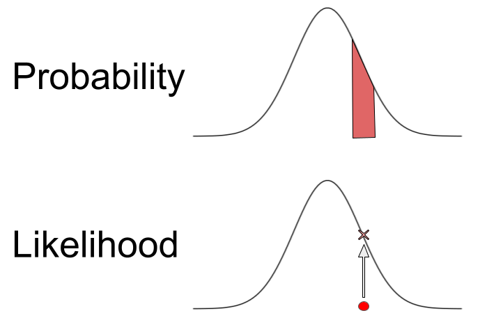

---
output:
  pdf_document: default
  html_document: default
---
# Likelihood
**Author:** Cole Brookson
**Date:** 29 August 2022

Likelihood can be a somewhat un-intuitive concept to begin to wrap one's head around, but it forms the basis for almost all common statistical methods. The goal of this section is to break down the concept without actually performing any tests or doing any coding, in the hopes that the reader will develop a more concrete understanding of likelihood before they need to attempt to *use* likelihood. 

## What is Likelihood? 

Likelihood itself, refers mostly to hypotheses. To quote from an excellent <a href="https://journals.sagepub.com/doi/10.1177/2515245917744314">discussion of the concept by Alexander Etz</a>: "The likelihood of a hypothesis <math>H</math> given some data <math>D</math> is the probability of obtaining <math>D</math> given that <math>H</math> is true multiplied by an arbitrary positive constant <math>K</math>: <math>L(H) = K × P(D|H).</math>"

While we can think of probability as being <em>area under a curve</em>, the likelihood is actually the y-axis value of the curve itself, at some value of the x-axis. 



One thing to note, is that a likelihood by itself is mostly uninterpretable. Likelihoods are only useful in the context of comparing them to one another. For example, to evaluate multiple competing hypotheses, we can compare the likelihood values for those different hypotheses and then decide which is best. 

Differently to a probability distribution function, which has to by definition sum to 1 (the sum of all the possibilities can't be greater or less than 1), a <strong>likelihood function</strong> does <strong>not</strong> have to sum to 1. The function is in fact scaled such that the best-supported value has a likelihood of 1. 

This function can take different forms depending on the situation at hand, and it's not always a perfect normal distribution like the above image suggests. 

### Maximum Likelihood Estimation 

This leads us to the central usefulness of likelihood, which is <em>maximum</em> likelihood, or the process of finding the maximum likelihood for a set of hypotheses. Usually this is in the context of parameter values. We can may have some very large possible number of parameter values, but the value that <em>maximizes</em> the likelihood of the data is the value we would choose as a parameter value. 

Say, for example, that we wanted to know the mean and standard deviation for some measure of a population. Let's turn to an example of sizes of cutthroat trout. From the <code>lterdatasampler</code> package, let's create a histogram of sizes of cutthroat trout:

```{r}
# load relevant packages
library(lterdatasampler)
library(dplyr)
library(ggplot2)
library(ggthemes)

# get relevant data
df <- lterdatasampler::hbr_maples

# plot histogram
ggplot(data = df) + 
  geom_histogram(aes(x = corrected_leaf_area), fill = "lightblue") +
  ggthemes::theme_base() +
  labs(x = "Leaf Area cm^2", y = "Count")
```


<strong> 
Note: it is important to remember generally when thinking about performing statistical tests we are trying to take a <em>sample</em> and infer something about the <em>population</em>. If we had data on the ENTIRE population, then we wouldn't even need statistics!!
</strong>

So, we want to get some mean and variance for our <em>population</em> given the information from this sample. Since this is approximately normally distributed we can use a normally distributed likelihood function to do so. 


