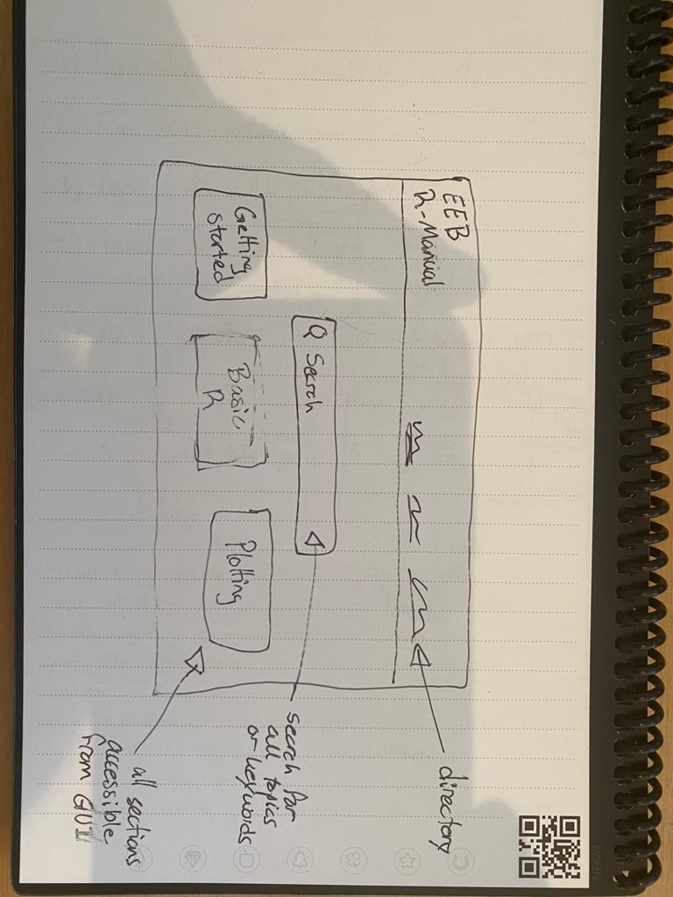
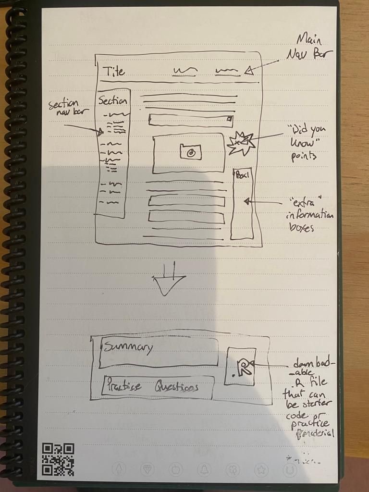

---
header-includes:
  - \usepackage{enumitem}
  - \setlistdepth{20}
  - \renewlist{itemize}{itemize}{20}
  - \renewlist{enumerate}{enumerate}{20}
  - \setlist[itemize]{label=$\cdot$}
  - \setlist[itemize,1]{label=\textbullet}
  - \setlist[itemize,2]{label=--}
  - \setlist[itemize,3]{label=*}
output:
  markdown::pdf_document:
      keep_tex: yes
---

# Suggested Outline for Introductory Modules

**Date:** 2022-05-20

**Author:** Cole Brookson

Presented below is the proposed order of information in draft form, that the R manual might take. I have outlined in each section the subsections that I think would be important to include, with room for addition/subtraction if need be. While the broad sections have some sort of logical flow in terms of what would need to be learned first, I don't see there as being as much of a difference in order after section 4. 

A few notes:

* I have not included anything yet in the statistics section as that will depend on the syllabus contents from Jacqueline as well as any other possible class syllabi I should be taking into account when creating the outline for that section
* I also intentionally left blank the sections 7 & 8 as to me those are the "further" secitons which don't necessarily need to be filled in at all, but if they are filled in, would definitely happen later down the line. 
* Some of these sections include more or less detail, but that doesn't correspond to the level of detail of information I imagine each would provide, but more a general outline of what useful headers would be in a finished product. 

## Order of Information

1. Getting Started
    1. Download R & RStudio
    2. Navigating RStudio
        1. Panes
        2. Appearance & Basics
        3. Working Directories
        4. Communicating with Your Computer
    3. The File Ecosystem
        1. `.R`
        2. `.Rmd`
        3. `.RProj`
2. Basic R 
    1. Coding Basics
        1. Assignment
        2. R as a Calculator
        3. Naming
        4. Logical Operators
        5. Using Functions
        6. Scripts & Workflow
    2. Objects
        1. Common Data Types
            1. `character`
            2. `numeric`
            3. `integer`
            4. `logical`
            5. `complex`   
        2. Data Structures
            1. Vectors
            2. Matrices
            3. Dataframes
            4. Arrays
        3. Checking Data Characteristics
            1. `str()`
            2. `type()`
            3. Visual Assessment
    3. Indexing
        1. Row & Column operators
        2. Dataframe `$`
    4. Packages
        1. How to Download 
        2. Using Package Functions
    5. Daily Workflow
        1. How to Write Programs
        2. How to 
3. Working With Data
    1. Reading & Writing
        1. Finding your data on the computer
        2. Local paths
    2. Simple Data Manipulation
        1. Filtering
        2. Subsetting
        3. Grouping & Summarizing
        4. Renaming
    3. Advanced Data Manipulation
        1. Re-leveling
        2. Reshaping
        3. Relating Multiple Dataframes
        4. Special Data Types
            1. Dates & Times
            2. Factors
            3. Strings
4. Plotting 
    1. The Grammar of Graphics
        1. `ggplot2` vs. `baseR`
        2. Basics of Readable Figures
    2. Common Plot Types
        1. Scatterplots
        2. Timeseries
        3. Boxplots/Violin plots
        4. Barplots
    3. Plotting from Multiple Dataframes
    4. Advanced plotting
        1. Maps
        2. Multiple paneled plots
        3. Heatplots
        4. Annotations
5. Programming Concepts
    1. Core Programming Topics
        1. Control Flow
            1. Choices
                1. If-statements
                2. `switch()`
            2. Loops
                1. `for` loops
                2. `while` loops
        2. Functions
            1. Building functions
            2. Nested functions
    2. Analysis Structure
        1. Breaking your analysis into files
        2. Sourcing Files
6. Introduction to Statistics
7. Simulations 
8. ? (Further Statistics?)

## Structure of Delivery

I have been thinking about how the material could be delivered and I am suggesting a web-based solution, with a simple landing page and branching page structure that takes students to segmented pages grouped by parent material. This would allow for quick searching for desired content but also for a "logical flow" approach if students need to go through it from start to finish. 

I imagine a langing page could look something like this:

While an actual content page would look different with more imformation. 

However this is obviously a first-pass idea. The main focus is of course getting content done (those early versions can take the form of simple html pages or pdfs). 

Some things to think about for a web-based delivery:

* Would be far more widely used across the department and across other institutions possibly
* Could possibly integrate into the existing infrastructure that the department webmaster has 
    * Cole can get in touch with the department IT people to discuss this possibility
* Offers a far more flexible mode of delivery with issues or problems being able to be rectified far more simply
* Possibility for really high-end extentions such as plug-in code snippets that the students can run on the web-page itself as opposed to having to download code
* Can host more media types (GIFs, videos, animations, etc.)