The easiest way to incorporate edits to code-based content (i.e. `html` or `markdown` based content) is via the source code, which for this project is being hosted on GitHub. 

There are a number of steps to get set up and ready to provide review on GitHub repositories. First, we'll need to sign up: [https://github.com/join](https://github.com/join). Once you have a username, please provide that username and the email associated with it to Cole, so he can add you to the repository. 

The *repository* is simply the place where all the information regarding a specific project is stored. The repository hosts the version control system **Git**, which does all of the version control work for the set of files of interest. 

Once you sign in, you may be prompted to set up your profile, which you can do if you want to. Once you are added to the repository, you will be able to edit and contribute to the repository of content, as well as provide feedback via *Pull Requests*. A pull request is *an event that takes place in software development when a contributor/developer is ready to begin the process of merging new code changes with the main project repository.* In this case, I am the contributer/developer, and I have new content that I want to merge into the reviewed and approved section of the repository. While doing this, I will ask for both of your feedback by asking you to be *reviewers* on each major pull request. 

## Getting started in GitHub

When you first sign into GitHub, the home page of the website will look like this: 

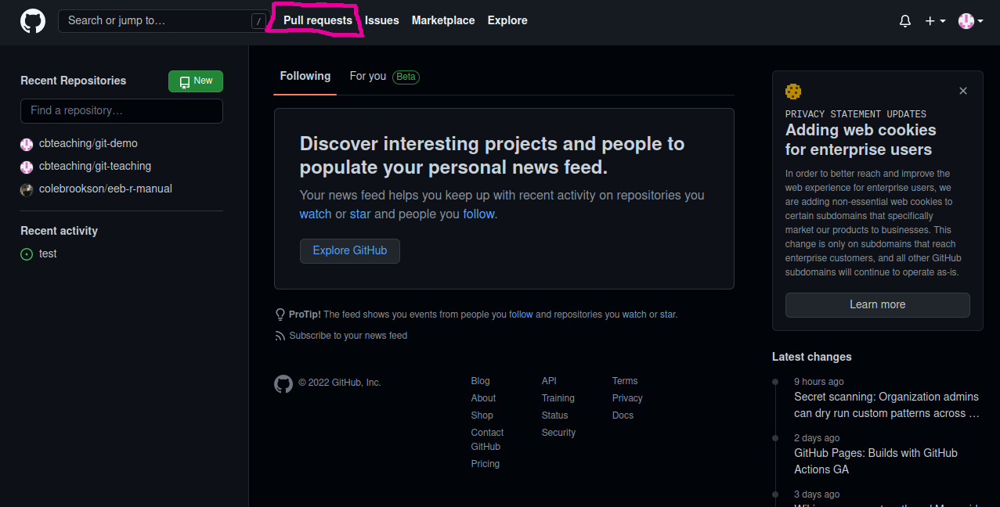

Here, the header **Pull Requests** is circuled in pink. This is the tab that you can go to, to see what pull requests Cole may have made, to ask for feedback. Click on that header, and it will take you to a second page. Click on *Review Requested* to see the pull requests that Cole has asked for your review on. For the rest of this small tutorial, I have made a real pull request, but used a second GitHub account of mine to go through the process of reviewing the Pull Request from your point of view. Anytime you see the username/account **cbteaching** that would be you in this scenario. So you will see something like this:

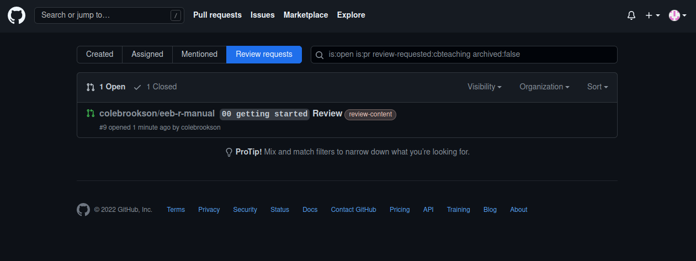

There is just one open pull request here. You can click on it, and that will take you to the repository home page. It will look like this: 

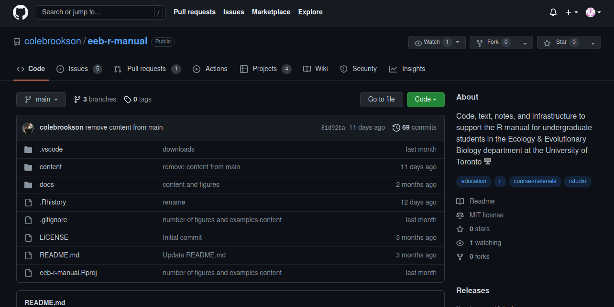  

You'll notice the tab called *Pull Requests* Click on that tab. You'll now see this:

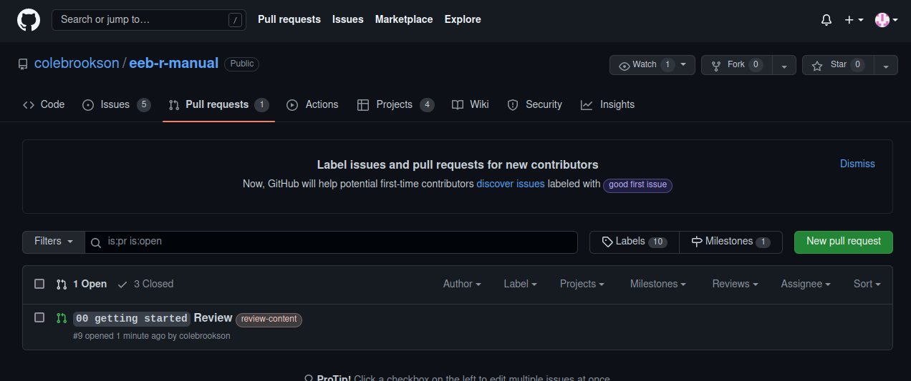

And you'll notice the name of the pull request that you had a notification to review. Click on the pull request. The head of the pull request will look like this: 

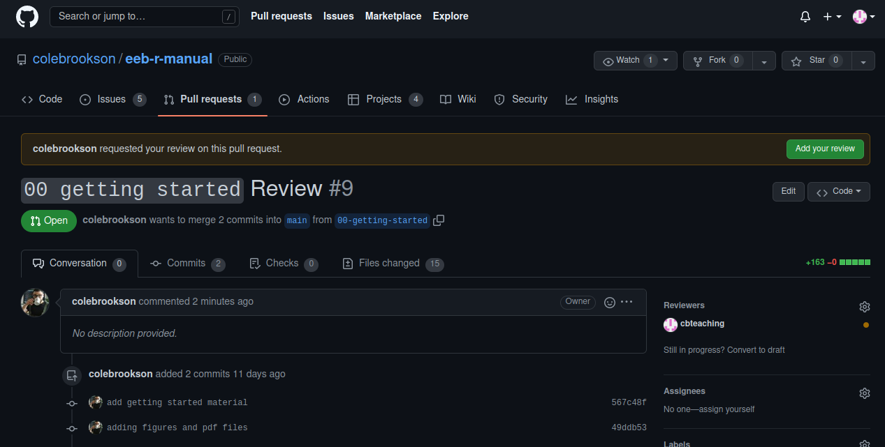

You'll see uptop *"`colebrookson` requested your review on this pull request"* and a place you can click called **Add your review**. Click on that button to begin reviewing. 

## Reviewing Files

Now we're in the thick of it. This is what you'll see when you click on **Add your review**:

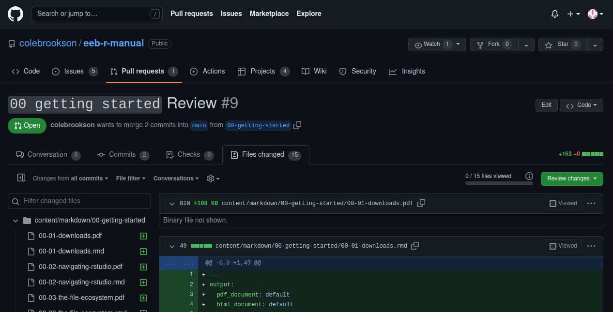 

This looks confusing but there's only a few things you'll need to actually worry about. First, on the left, you'll see that there are a number of files that have changed, and a progress bar that says `0/15 files viewed`. Now you can start the actual review. Since a pdf is easier to view and that's where you can actually see the photos that I might include (i.e. screenshots of RStudio or the like), I recommend viewing the `.pdf` file, but making comments on the `.rmd` file. 

To view the `.pdf`, I recommend opening it in another tab/window. If you click on the three dots on the far right of the header of the pdf file (in this example, we're looking at `content/markdown/00-getting-started/00-01-downloads.pdf`), you'll see a dropdown box open up: 

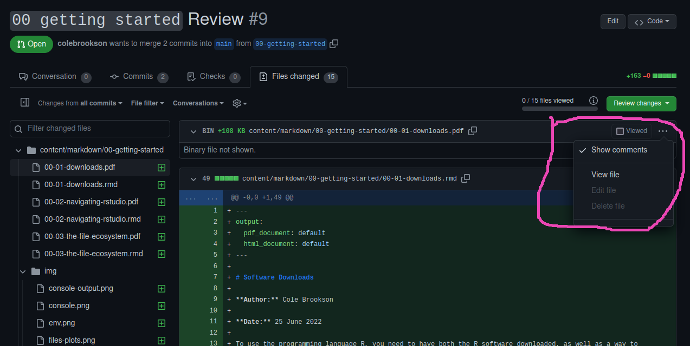

You'll see the option to *View file*. Right click this and open it in a new tab. In this example, if we open this `.pdf` in a new tab/window, we'll see this: 

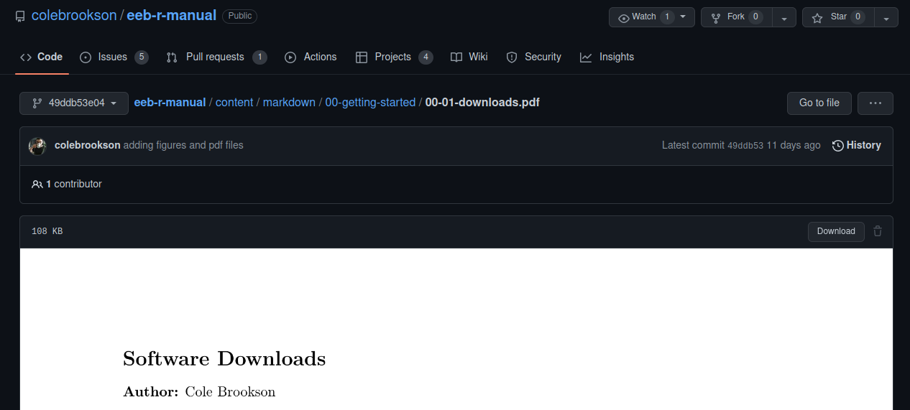

You can then scroll through the `.pdf` document to see all the content for that particular subsection. You can of course proceed from this point however you like, but my recommendation based on doing this in the past, would be to read through this briefly to form your overall impression of the section from the `.pdf` version, since it's easier to look at and digest, and you can see the images. Then, once you're ready to make any line specific comments, you can go back to the review (The tab you left when you opened this `.pdf` file in the new tab) and leave comments. 

### Leaving Comments

Back on the other page, if you begin scrolling down, you'll see the raw `.rmd` file with the text and information that gets turned into the pdf:

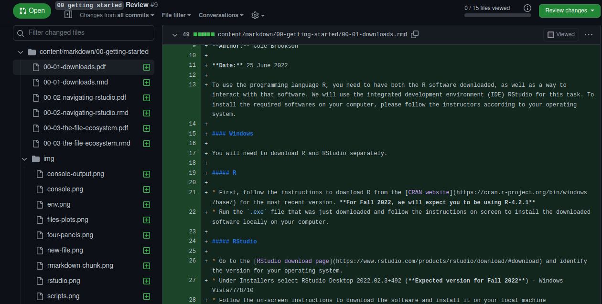

You can leave comments on a particular section by clicking on the *+* symbol beside the line number in question. For example, say you want to leave a comment on the paragraph starting at line 13. You might want to suggest a wording change: 

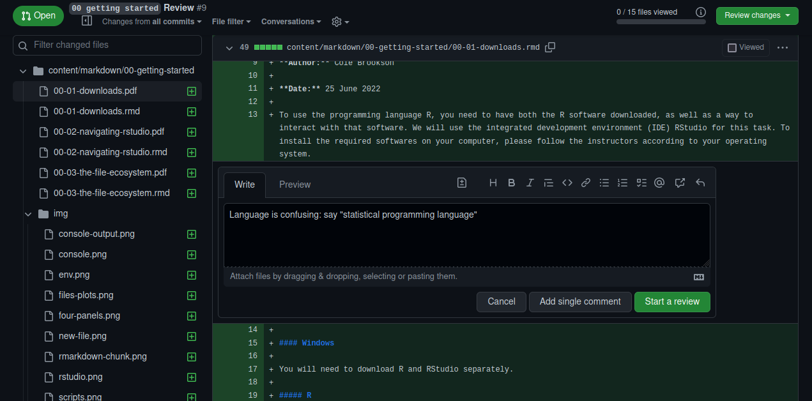

Once you click the plus sign, you can leave the comment. Since this is the first comment, you'll want to then click **Start a review** to leave the comment and continue leaving comments. Once you click that, the comment will look like this: 

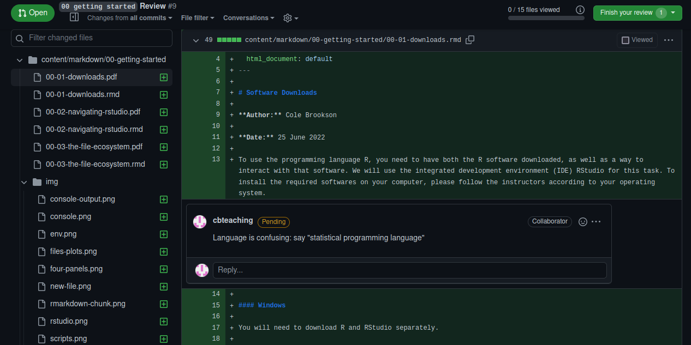

After leaving your comment, you can continue moving through the `.rmd` document leaving specific line comments anywhere you want to. Once you scroll to the bottom of the document, you'll see the next set of `.pdf` and `.rmd` files. The next one in this pull request is about Navigating RStudio: 

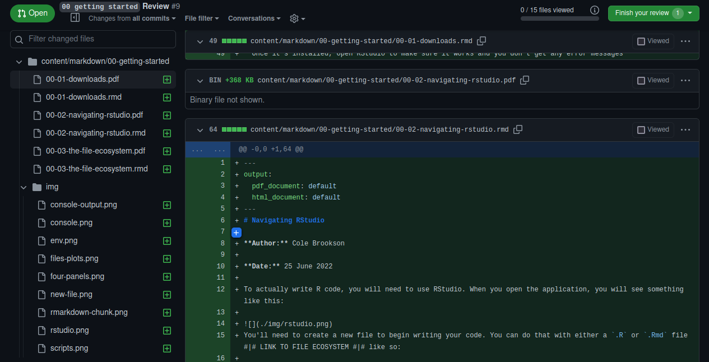

Now, I would recommend you repeating the process of opening up a new tab with the `.pdf`, looking through that, then making line comments in the `.rmd`. Also, this is optional, but notice in the above screenshot, at the top of the document there is a clikable box that says **Viewed**. Once you've finished looking through a file and providing comments, feel free to click that box as it will simply the view for you. 

With this next file, say you repeat the process, you open the pdf in a new tab/window: 

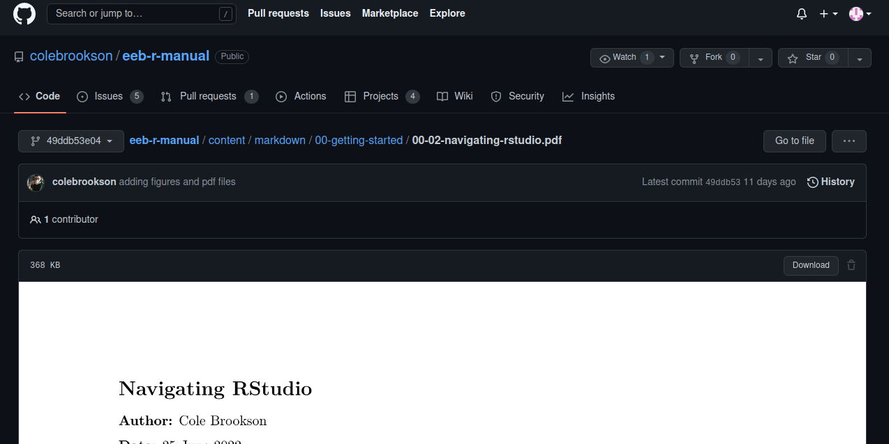

You might scroll through that document, find the sections you want to comment on, then go back to the `.rmd` file to make the comments. For example, you might want to leave a comment on line 46 - again, you press the **+** button beside the line number, and leave your comment, pressing **Add review comment** to post the comment: 

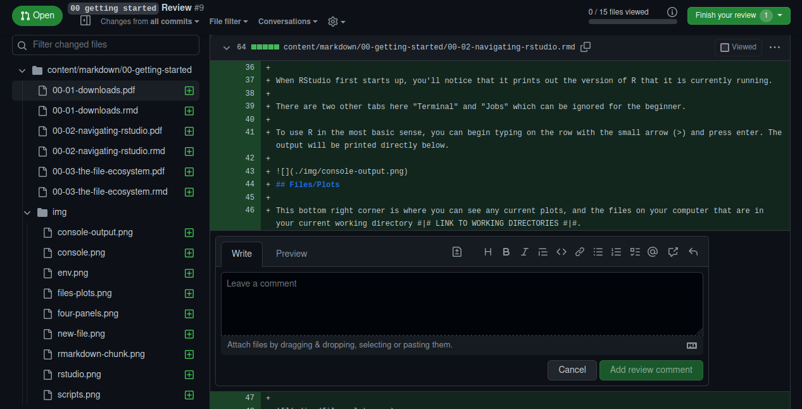

You would then repeat this process for all the files in this pull request at your leisure. Note that you *do NOT* have to go through all the files in one sitting, you can absolutely come back to it if need by. 

## Completing the Review

You'll notice in the above screenshot there is a button in the top right corner that says **Finish your review**. Once you've viewed and commented where you want to in the files, you can finish the review, which will notify me that I can go and address the comments etc. 

Click on that button and you'll see a drop-down menu: 

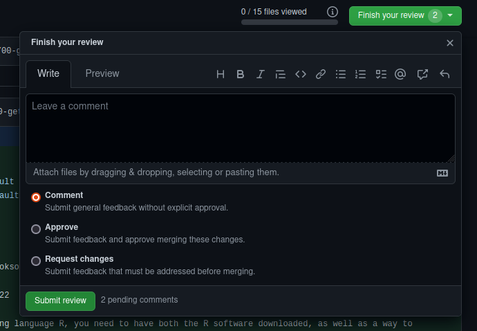

You'll notice you have three options here. It is actually helpful for me if you pick the one of the three that best corresponds to your impression of the work. As the descriptions say, you can simply *Comment* to provide feedback that isn't explicitly approving it - this might be good if there are large things that can be improved in the future, but nothing that is explicitly *wrong* with the current version (e.g. examples are definitely needed etc). *Approve* is best when you may have a few small edits but nothing major needs to change. The *Request Changes* is best for when there are more serious problems that you've caught in the content that need to be changed before thiss content reaches the students. 

Also, importantly, this *Leave a comment* section is the best place to provide overall feedback that might not fit as a line comment. Something like "More examples needed throughout" or something like that can go here, and that's really helpful to me!

Then (finally!) you are done the review! and you can press **Submit review**. This will notify me that your review is ready for me to look at and incorporate. 

You have now finished the review of this section!
